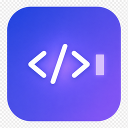
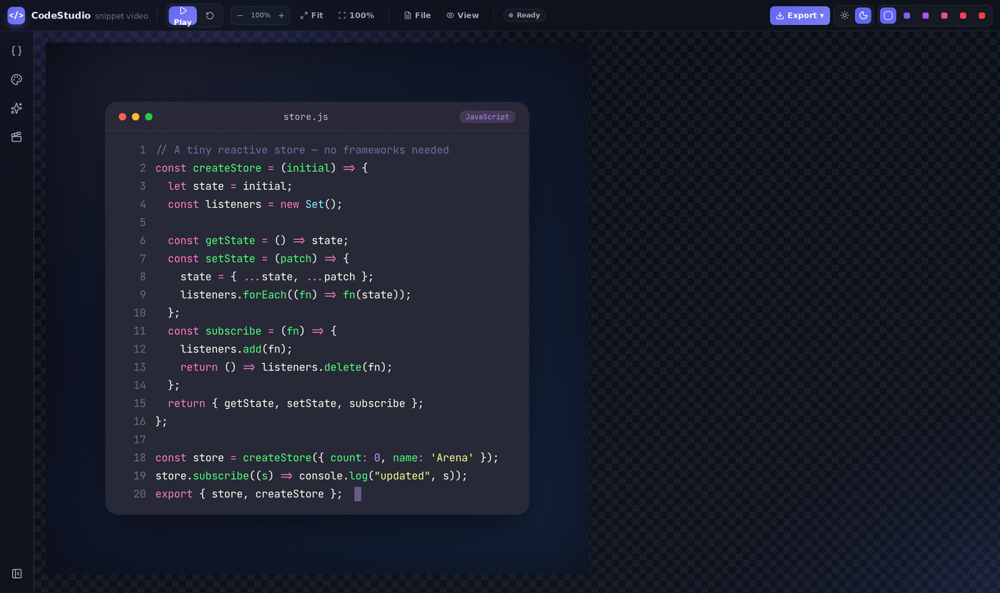
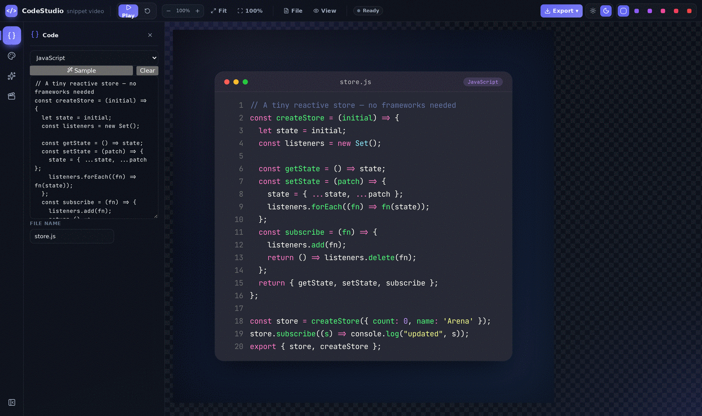
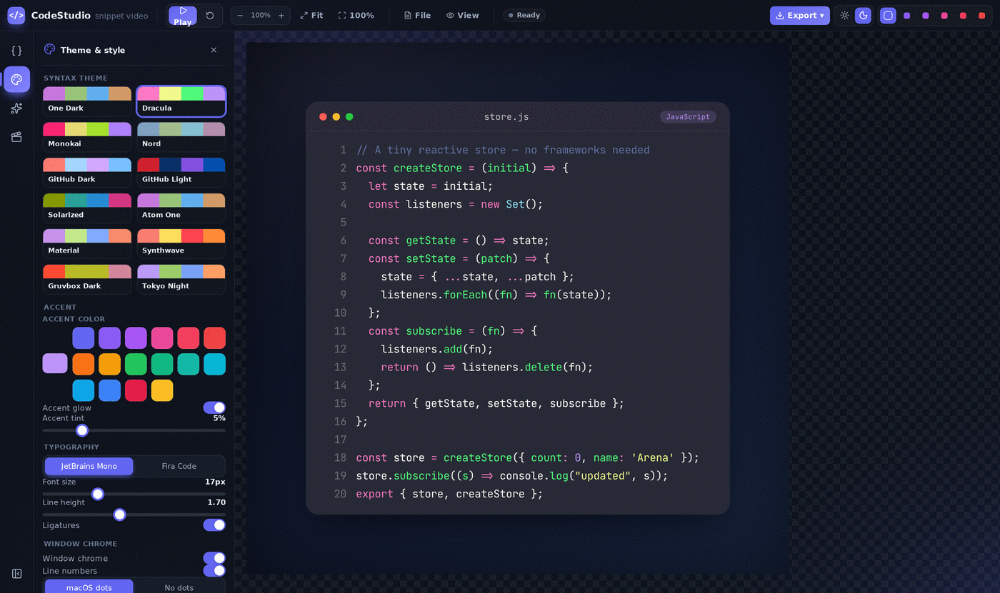
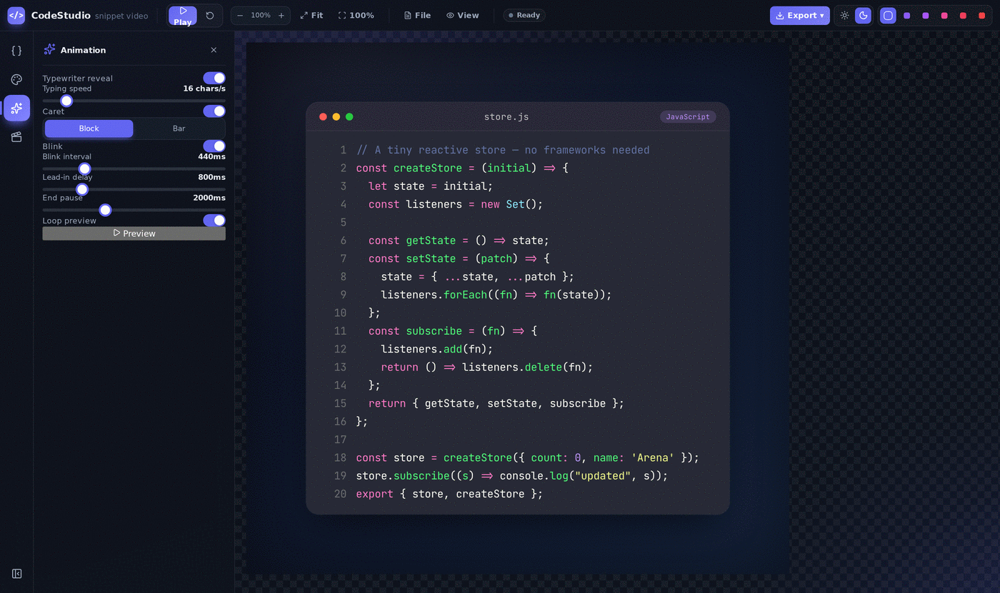
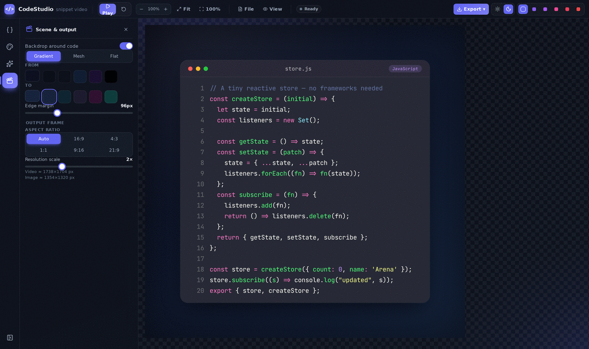
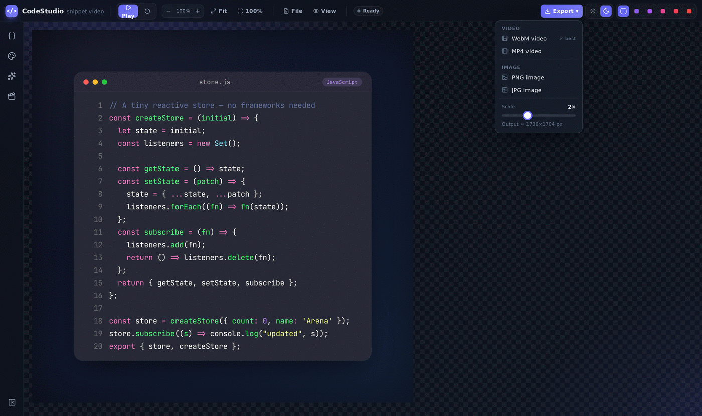
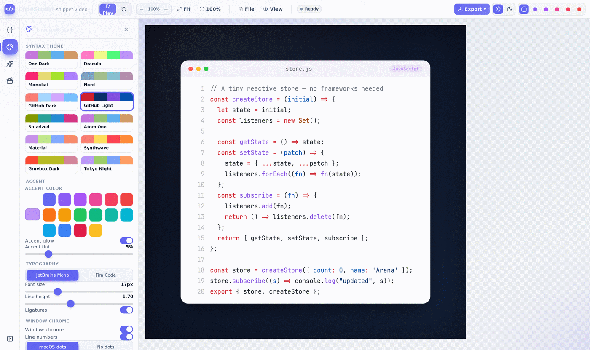
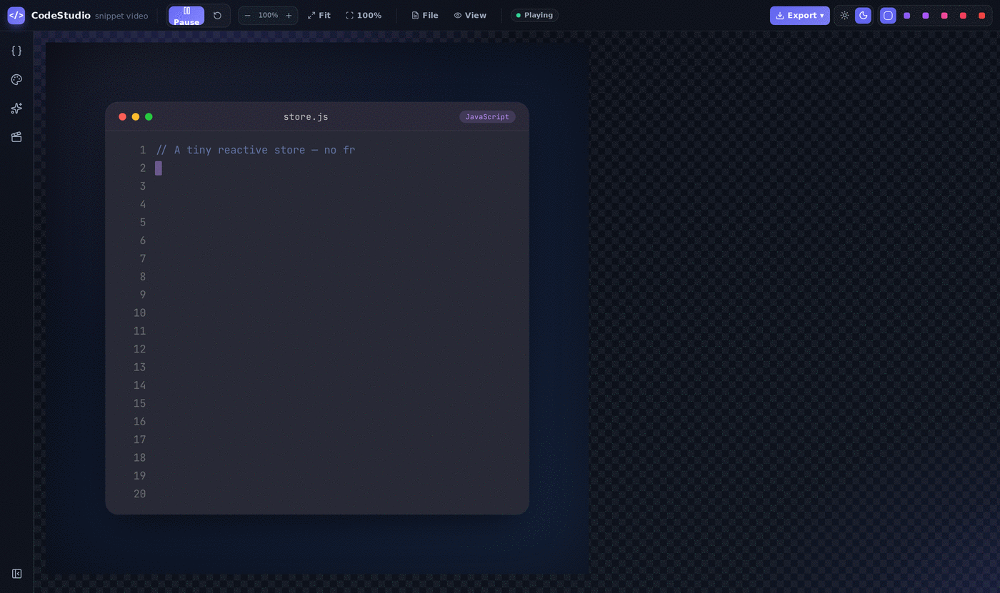

<div align="center">



# CodeStudio

**Turn code snippets into beautiful, animated videos and images — entirely in your browser.**

`React 19` · `Vite 8` · `Prism.js` · `html2canvas` · `MediaRecorder` · 100% client-side



</div>

---

## Table of contents

- [What is CodeStudio?](#what-is-codestudio)
- [Who is it for?](#who-is-it-for)
- [Frontend or backend?](#frontend-or-backend)
- [Quick start](#quick-start)
- [How to use it](#how-to-use-it)
  - [The workspace](#the-workspace)
  - [1 · Code panel](#1--code-panel)
  - [2 · Theme & style panel](#2--theme--style-panel)
  - [3 · Animation panel](#3--animation-panel)
  - [4 · Scene & output panel](#4--scene--output-panel)
  - [5 · Exporting](#5--exporting)
- [Feature reference](#feature-reference)
- [How it works internally](#how-it-works-internally)
- [Project structure](#project-structure)
- [Configuration reference](#configuration-reference)
- [Screenshots (Playwright)](#screenshots-playwright)
- [Browser support & limitations](#browser-support--limitations)
- [Troubleshooting](#troubleshooting)
- [Extending CodeStudio](#extending-codestudio)

---

## What is CodeStudio?

CodeStudio is a **single-page web application** that takes a block of source
code and renders it into a polished, macOS-style "code window", then lets you
**animate it with a typewriter reveal** and **export the result as a video
(WebM / MP4) or a still image (PNG / JPG)**.

It is the kind of asset generator you'd reach for when you need:

- an animated code clip for a tutorial, conference talk, or course
- a code screenshot for a blog post, README, or documentation page
- a short looping snippet for social media (Twitter/X, LinkedIn, TikTok, Shorts)
- a title card or B-roll for a screencast

Think "Carbon / ray.so, but it also records video, and the recording is a real
typing animation rather than a static image."

**Everything happens locally in your browser.** There is no account, no upload,
no server round-trip, and no telemetry. Your source code never leaves the tab.

### The core loop

```
paste code → pick a language → pick a syntax theme → tune the animation
           → set a backdrop and aspect ratio → hit Export
```

---

## Who is it for?

| Audience | Why they'd use it |
|---|---|
| **Developer educators / course creators** | Animated code reveals for lessons without editing in After Effects. |
| **Technical writers & DevRel** | Consistent, on-brand code screenshots for docs and launch posts. |
| **Conference speakers** | Slide-ready code that types itself in, with correct aspect ratios. |
| **Open-source maintainers** | Attractive hero images for a README or landing page. |
| **Social / marketing teams** | 9:16 and 1:1 clips of code for short-form video. |
| **Anyone sharing code** | Beats a blurry screenshot of an editor at 2am. |

You need **no build knowledge to use it** — you just need a modern browser.
You need Node.js only to *run the project locally*.

---

## Frontend or backend?

> **This project is 100% frontend.** There is no backend, no API, no database,
> and no server-side rendering.

Concretely:

- **Frontend** — a React 19 SPA bundled by Vite 8. Entry point `index.html` →
  `src/main.jsx` → `src/App.jsx`. All state lives in React `useState`.
- **Backend** — *none exists*. The only server involved is the Vite dev server
  (`npm run dev`) or whatever static host serves the `dist/` folder after
  `npm run build`. Neither one processes your code.
- **Rendering & encoding** — done by browser APIs: `Prism.highlight()` for
  tokenizing, DOM + inline styles for layout, `html2canvas` for rasterizing,
  `HTMLCanvasElement.captureStream()` + `MediaRecorder` for video encoding, and
  `canvas.toBlob()` for images.
- **Deployment** — because the build output is pure static assets, you can host
  it on GitHub Pages, Netlify, Vercel, Cloudflare Pages, S3, or any file server.
  No runtime, no environment variables, no secrets.

**Data & privacy:** nothing is persisted. Reloading the page resets to the
built-in default snippet. Nothing is written to `localStorage` or sent over the
network beyond loading the app's own JS/CSS/font assets.

---

## Quick start

**Requirements:** Node.js 18+ (Node 20/22 recommended) and npm.

```bash
git clone <this-repo>
cd CodeVideo

npm install      # install dependencies
npm run dev      # start the dev server → http://localhost:5173
```

Open the printed URL. That's it — no `.env`, no services to spin up.

### Other scripts

| Command | What it does |
|---|---|
| `npm run dev` | Vite dev server with HMR on **:5173** (bound to `0.0.0.0`). |
| `npm run build` | Production build into `dist/`. |
| `npm run preview` | Serves the built `dist/` on **:4173** to sanity-check the bundle. |
| `npm run screenshots` | Drives the running app with Playwright and refreshes `docs/screenshots/`. |

### Deploying

```bash
npm run build
# upload the contents of dist/ to any static host
```

If you deploy under a sub-path (e.g. GitHub Pages project sites), set
`base: '/your-repo/'` in `vite.config.js` before building.

---

## How to use it

### The workspace


The UI is laid out like a small editor:

| Region | Purpose |
|---|---|
| **Menu bar** (top) | Brand, transport controls (Play/Pause/Reset), zoom pill, **Fit** / **100%**, `File` and `View` menus, a status dot, the **Export ▾** button, and app-theme + app-accent switches on the far right. |
| **Activity bar** (far left) | Four icon buttons that open the inspector: **Code**, **Theme & style**, **Animation**, **Scene & output**. Click the active one again to collapse. |
| **Inspector** (left panel) | The controls for whichever section is open. Collapsed by default so the preview gets maximum room. |
| **Stage** (center) | The live preview of exactly what will be exported. The checkerboard means "transparent / outside the frame". |

**Transport & zoom**

- **Play / Pause** — runs the typewriter animation in the preview.
- **Reset** (↺) — stops playback and snaps back to fully-typed code.
- **− 100% +** — zooms the preview. This is a *preview-only* scale; it does not
  change export resolution.
- **Fit** — shrinks the whole scene to fit the visible stage area.
- **100%** — actual pixel size (1:1 with what gets exported at 1× scale).
- **Status dot** — grey `Ready`, green `Playing`, amber `Rendering…`/`Generating…`.

---

### 1 · Code panel



Open with the `{ }` icon.

1. **Language dropdown** — pick from 32 languages (see the full list under
   [Feature reference](#feature-reference)). Changing the language re-highlights
   the code and auto-renames the file to `sample.<ext>`.
2. **Sample** — loads a realistic, idiomatic snippet for the selected language.
   Great for trying out themes quickly.
3. **Clear** — empties the editor.
4. **Code editor** — a plain `<textarea>`. Paste anything; tabs are normalized to
   four spaces. Highlighting updates as you type.
5. **File name** — the label shown in the window's title bar, and the stem of the
   downloaded file (`store.js` → `store.png`, `store-video.webm`).

> If a language has no Prism grammar loaded, the panel shows
> *"No highlighter — showing plain text."* and the code renders unstyled but
> still fully laid out and animatable.

---

### 2 · Theme & style panel



Open with the palette icon. Four groups:

**Syntax theme** — a 12-swatch grid: One Dark, Dracula, Monokai, Nord,
GitHub Dark, GitHub Light, Solarized, Atom One, Material, Synthwave,
Gruvbox Dark, Tokyo Night. Each theme supplies the window background, the text
color, and ~20 token colors.

**Accent** — an *independent* accent used for the language badge, the caret, and
the corner glow. It is deliberately separate from the syntax theme so you can
match brand colors.
- *Accent glow* — a soft radial wash of the accent in the window's top-left.
- *Accent tint* (0–25%) — blends the accent into the title-bar background.

**Typography**
- Font: **JetBrains Mono** or **Fira Code** (both bundled, so exports match the
  preview exactly on every machine).
- Font size: 10–34 px · Line height: 1.20–2.40 · Ligatures on/off.

**Window chrome**
- *Window chrome* — show/hide the whole title bar.
- *Line numbers* — show/hide the gutter.
- *macOS dots* / *No dots* — the traffic-light buttons.
- *Corner radius* 0–40 px · *Content padding* 8–60 px · *Rounded corners* toggle.

---

### 3 · Animation panel



Open with the sparkles icon. This defines the video's timeline.

| Control | Range | Meaning |
|---|---|---|
| **Typewriter reveal** | on/off | Off = the code appears instantly (good for a static-looking clip). |
| **Typing speed** | 3–120 chars/s | How fast characters are revealed. ~16–25 reads naturally. |
| **Caret** | on/off | Show the cursor. |
| **Block / Bar** | — | Block = a translucent full-cell caret; Bar = a thin vertical line. |
| **Blink** + **Blink interval** | 150–1500 ms | Caret blink cadence. |
| **Lead-in delay** | 0–4000 ms | Dead air before typing starts — gives the viewer a beat to settle. |
| **End pause** | 0–6000 ms | How long the finished code holds before the clip ends. |
| **Loop preview** | on/off | Repeats in the preview. **Exports never loop** — a recording always runs exactly once. |
| **Preview** | button | Restarts the animation from zero. |

**Estimating clip length:**

```
duration ≈ lead-in + (total characters ÷ typing speed) + end pause
```

So 700 characters at 20 chars/s with 800 ms lead-in and a 2000 ms end pause is
roughly `0.8 + 35 + 2 = ~37.8 seconds`.

---

### 4 · Scene & output panel



Open with the clapperboard icon. This controls the *frame around* the code
window — the part that makes a clip look like a designed asset rather than a
screenshot.

**Backdrop around code** — toggle the surrounding canvas on/off. With it off,
the export is the bare code window (transparent margins).

- **Gradient / Mesh / Flat** — three backdrop styles built from two colors.
- **From / To** — the two backdrop colors, with curated swatches plus a custom picker.
- **Edge margin** — 30–260 px of breathing room between the window and the frame edge.

**Output frame**

- **Aspect ratio** — `Auto`, `16:9`, `4:3`, `1:1`, `9:16`, `21:9`.
  *Auto* hugs the code window plus the margin; any fixed ratio letterboxes the
  window inside a correctly-proportioned frame (use `9:16` for Reels/Shorts,
  `1:1` for feed posts, `16:9` for YouTube/slides).
- **Resolution scale** — 1×–4×. This is the real multiplier applied at capture
  time, so 2× on a 900×760 scene yields a 1800×1520 file.
- A live **hint** shows the exact pixel dimensions you'll get for both video and
  image exports.

---

### 5 · Exporting



Click **Export ▾** in the top-right. The dropdown also carries its own
**Scale** slider and an `Output ≈ W×H px` readout, so you can adjust resolution
without leaving the menu.

| Option | Output | Notes |
|---|---|---|
| **WebM video** | `<filename>-video.webm` | ✓ Recommended. Works in every browser with `MediaRecorder`. |
| **MP4 video** | `<filename>-video.mp4` | Requires a browser whose `MediaRecorder` can mux MP4 (Chrome 126+, Safari 18+). Falls back to WebM if unsupported. |
| **PNG image** | `<filename>.png` | Lossless still of the code window. Downscaled if either side would exceed 2000 px. |
| **JPG image** | `<filename>.jpg` | Smaller, lossy still. |

**What gets captured:**

- **Video** captures the *whole scene* — backdrop, margins, aspect-ratio frame,
  and the code window animating inside it.
- **Images** capture *just the code window* (`[data-cs-stage]`), not the backdrop.

**During a video export** the status pill turns amber and reads `Rendering…`.
The animation plays once with looping forced off, the recorder captures each
frame, and the file downloads automatically when it finishes. A toast confirms
the dimensions and container, e.g. `Video saved · 1738×1704 · .WEBM`.

> ⚠️ Video recording is real-time — a 40-second clip takes ~40 seconds to
> render. Keep the tab in the foreground; background tabs get their frame rate
> throttled by the browser, which produces a stuttery file.

**Light theme** — the entire app plus the code window can go light, via
`View → Light theme` or the sun icon, paired with a light palette like
GitHub Light or Solarized:



And here's the typewriter mid-reveal, block caret visible:



---

## Feature reference

### Languages (32)

JavaScript · TypeScript · JSX (React) · TSX (React) · Python · Java · C · C++ ·
C# · Go · Rust · Ruby · PHP · Swift · Kotlin · Dart · SQL · JSON · YAML ·
Bash/Shell · PowerShell · CSS · SCSS · Less · GraphQL · HTML · XML · TOML · INI ·
Dockerfile · Nginx · Plain Text

Each ships with a one-click **sample snippet** and a sensible file extension.

### Syntax themes (12)

One Dark · Dracula · Monokai · Nord · GitHub Dark · GitHub Light · Solarized ·
Atom One · Material · Synthwave · Gruvbox Dark · Tokyo Night

Each theme defines `bg`, `bg2`, `text`, `accent`, plus colors for the normalized
token categories: `comment`, `string`, `keyword`, `func`, `class`, `number`,
`operator`, `punctuation`, `property`, `tag`, `attr`, `var`, `constant`,
`builtin`, `decorator`, `regex`, `bool`, `module`, `type`, `char`.

### App chrome

The application shell itself is themeable and **independent of the code theme**:
a dark (default) or light UI, plus an app accent chosen from six swatches in the
top-right. Handy when you're recording your screen and want the tool to match
your setup.

---

## How it works internally

The pipeline has five stages. Understanding it makes the settings — and the
limitations — obvious.

```
 source text
     │
     ▼
┌──────────────────────────────────────────────────────────┐
│ 1. TOKENIZE            src/lib/model.js                  │
│    Prism.highlight() per line → HTML → regex-parsed into │
│    normalized segments → flattened to a char array.      │
│    Output: { lines: [{ text, segments, chars }] }        │
└──────────────────────────────────────────────────────────┘
     │
     ▼
┌──────────────────────────────────────────────────────────┐
│ 2. LAYOUT              src/CodeWindow.jsx                │
│    Monospace advance width measured once via a 2D canvas │
│    (measureAdvance) → exact gutter, content, and window  │
│    dimensions computed in JS, applied as inline styles.  │
└──────────────────────────────────────────────────────────┘
     │
     ▼
┌──────────────────────────────────────────────────────────┐
│ 3. ANIMATE             src/App.jsx (beginPlay)           │
│    requestAnimationFrame loop maps elapsed time → a      │
│    `typed` character count. distribute() spreads that    │
│    count across lines and derives the caret row/column.  │
└──────────────────────────────────────────────────────────┘
     │
     ▼
┌──────────────────────────────────────────────────────────┐
│ 4. COMPOSE             src/App.jsx (sceneInner)          │
│    The window is centered inside a backdrop box sized by │
│    the chosen aspect ratio and edge margin.              │
│    Rendered TWICE: once visible (zoomable) and once      │
│    offscreen at left:-30000px, untransformed, for clean  │
│    1:1 capture.                                          │
└──────────────────────────────────────────────────────────┘
     │
     ▼
┌──────────────────────────────────────────────────────────┐
│ 5. CAPTURE             src/lib/capture.js                │
│    Images: html2canvas → canvas.toBlob('image/png'|'jpeg')│
│    Video:  html2canvas per frame → drawImage onto a      │
│            <canvas> → canvas.captureStream(30) →         │
│            MediaRecorder @ 20 Mbps → Blob → download.    │
└──────────────────────────────────────────────────────────┘
```

### Key design decisions

**Why an offscreen capture copy?**
The visible preview is CSS-`transform: scale()`d for zoom, and `html2canvas`
does not reliably rasterize transformed subtrees. So the same scene is mounted a
second time at `position: fixed; left: -30000px` with no transform. Captures
always read that copy, which is why zooming never affects export quality.

**Why measure the font with a canvas?**
Character advance is needed to place the caret and size the window *before*
paint. `measureAdvance()` renders 20 `W`s to a throwaway 2D context and divides.
The result is cached per font family, and the cache is cleared ~450 ms after
mount (`clearFontMeasure()`) once the bundled webfonts have actually loaded — so
the layout re-measures against the real font rather than a fallback.

**Why re-parse Prism's HTML instead of rendering it?**
`model.js` runs Prism per line, then walks the emitted markup with a regex to
produce `{ text, type }` segments, mapping ~40 Prism token classes down to ~20
normalized categories. This decouples rendering from Prism's CSS: any theme can
color any language, and every character is individually addressable — which is
exactly what the per-character typewriter reveal needs.

**Why is video capture real-time?**
`MediaRecorder` encodes a live `MediaStream`; there's no seek or offline mode.
The recorder pumps `html2canvas` in a self-scheduling async loop targeting 30 fps
and copies each raster onto the stream canvas. Heavy scenes rasterize slower than
30 fps, so the effective frame rate can drop — the output is still correct, just
less smooth.

**Bitrate** is pinned at `videoBitsPerSecond: 20_000_000` (20 Mbps) so text stays
crisp instead of turning to mush under codec compression.

**MIME negotiation** (`pickMime`) tries, in preference order, `avc1` MP4 →
VP9 MP4 → plain MP4 → VP9 WebM → VP8 WebM → plain WebM (or the WebM group first
when you pick WebM), returning the first that `MediaRecorder.isTypeSupported()`
accepts. If nothing matches, you get a toast telling you to try Chrome.

---

## Project structure

```
CodeVideo/
├── index.html                 # SPA shell; mounts #root
├── vite.config.js             # React plugin, dev :5173 / preview :4173, host 0.0.0.0
├── package.json
├── docs/
│   ├── logo.png               # project logo
│   └── screenshots/           # generated by npm run screenshots
├── scripts/
│   └── screenshots.mjs        # Playwright capture script
└── src/
    ├── main.jsx               # createRoot; owns app-level theme/accent state
    ├── App.jsx                # the whole workspace: state, menus, inspector,
    │                          #   animation engine, export handlers, scene composer
    ├── CodeWindow.jsx         # pure renderer for one code window + caret
    ├── index.css              # design system: CSS vars, dark/light themes, all widgets
    ├── ui/
    │   └── Controls.jsx       # Panel, Slider, Switch, Segmented, Swatches,
    │                          #   ColorField, TextField, Btn
    └── lib/
        ├── model.js           # Prism → normalized token model; language ↔ extension map
        ├── languages.js       # LANGUAGES list, Prism grammar imports, sampleFor()
        ├── themes.js          # the 12 code palettes
        ├── capture.js         # html2canvas + MediaRecorder; PNG/JPG/video
        ├── color.js           # hex/rgba parsing, mix(), alpha(), readableOn()
        └── geom.js            # char-width constant, palette token resolve, withAlpha
```

### Module responsibilities

| File | Exports | Role |
|---|---|---|
| `lib/model.js` | `buildModel`, `langLabel`, `langFileExt`, `grammarExists`, `prismGrammar` | Turns raw text + a language id into `{ lines: [{ text, segments, chars, widthChars }] }`. |
| `lib/languages.js` | `LANGUAGES`, `sampleFor`, `prismLangId`, `hasGrammar` | Registry of supported languages, their Prism grammar imports, and demo snippets. |
| `lib/themes.js` | `codeThemes` | Object keyed by theme id; each value is a full token palette. |
| `lib/capture.js` | `capturePNG`, `captureJPG`, `startRecording`, `pickMime`, `toCanvas`, `VIDEO_TYPES` | All rasterization and encoding. The only place that touches `html2canvas` / `MediaRecorder`. |
| `lib/color.js` | `hexToRgb`, `toRgba`, `mix`, `alpha`, `readableOn`, `rgbToCss` | Color math for gradients, tints, and contrast-aware text. |
| `lib/geom.js` | `CHAR_RATIO`, `charW`, `resolve`, `withAlpha` | Shared layout constants and palette lookup. |
| `CodeWindow.jsx` | default, `measureAdvance`, `clearFontMeasure` | Stateless render of one window given `(model, typed, cfg)`. |
| `ui/Controls.jsx` | `Panel`, `Slider`, `Switch`, `Segmented`, `Swatches`, `ColorField`, `TextField`, `Btn` | Reusable inspector widgets. |

---

## Configuration reference

All user settings live in one `cfg` object in `App.jsx` state. Useful when
changing defaults or adding presets.

| Key | Default | Meaning |
|---|---|---|
| `language` | `'javascript'` | Active language id. |
| `code` | built-in reactive-store snippet | The source text. |
| `fileName` | `'store.js'` | Title-bar label + download stem. |
| `font` | `'jetbrains'` | `'jetbrains'` \| `'fira'`. |
| `fontSize` | `17` | px, 10–34. |
| `lineHeight` | `1.7` | multiplier, 1.2–2.4. |
| `ligatures` | `true` | `font-variant-ligatures`. |
| `lineNumbers` | `true` | Gutter visibility. |
| `chrome` | `true` | Title bar visibility. |
| `controls` | `'mac'` | `'mac'` \| `'none'`. |
| `rounded` / `radius` | `true` / `20` | Corner rounding, 0–40 px. |
| `padding` | `26` | Content padding, 8–60 px. |
| `paletteKey` | `'dracula'` | Key into `codeThemes`. |
| `outputAccent` | `'#bd93f9'` | Accent used inside the exported window. |
| `bgAccent` | `true` | Corner accent glow. |
| `tint` | `0.05` | Accent blended into the title bar, 0–0.25. |
| `frameLine` / `frameLineOpacity` | `'#ffffff'` / `0.09` | 1 px hairline border. |
| `backdrop` | `true` | Render the surrounding scene. |
| `backdropKind` | `'grad'` | `'grad'` \| `'mesh'` \| `'plain'`. |
| `bgFrom` / `bgTo` | `'#0d1020'` / `'#15233c'` | Backdrop colors. |
| `backdropMargin` | `96` | px around the window, 30–260. |
| `aspect` | `'auto'` | `auto` \| `16:9` \| `4:3` \| `1:1` \| `9:16` \| `21:9`. |
| `instant` | `false` | `true` disables the typewriter. |
| `cps` | `16` | Characters per second, 3–120. |
| `caretOn` | `true` | Show the caret. |
| `caretStyle` | `'block'` | `'block'` \| `'bar'`. |
| `caretBlink` / `blinkMs` | `true` / `440` | Blink and its interval (150–1500 ms). |
| `startDelay` | `800` | Lead-in ms, 0–4000. |
| `endPause` | `2000` | Hold-at-end ms, 0–6000. |
| `loop` | `true` | Preview looping (never applies to exports). |

Export settings live in a separate `ex` object: `videoFormat` (`'webm'` \|
`'mp4'`) and `resScale` (`1`–`4`).

---

## Screenshots (Playwright)

The images in this README are generated, not hand-taken, so they never drift
from the actual UI.

```bash
# terminal 1
npm run dev

# terminal 2
npm run screenshots
```

`scripts/screenshots.mjs` launches headless Chromium at 1600×950 with
`deviceScaleFactor: 2`, waits for the webfonts to settle and the layout to
re-measure, then walks the app: default workspace → each of the four inspector
panels → the Export menu → the animation mid-reveal → the light theme with the
GitHub Light palette. Output lands in `docs/screenshots/` as
`01-workspace.png` … `08-light-theme.png`.

**First-time setup**

```bash
npm install                    # playwright is already a devDependency
npx playwright install chromium
```

**Environment variables**

| Variable | Default | Purpose |
|---|---|---|
| `BASE_URL` | `http://localhost:5173` | Point at a different dev server or a deployed build. |
| `CHROME_PATH` | Playwright's managed Chromium | Use a system Chrome/Chromium instead — useful in locked-down CI or sandboxes where `playwright install` can't reach its CDN. |

```bash
BASE_URL=http://localhost:4173 CHROME_PATH=/usr/bin/chromium npm run screenshots
```

Adding a shot is a few lines — call `openPanel(page, '<tooltip>')` (or
`openMenu(page, '<label>')`) and then `shot(page, '09-my-shot')`.

---

## Browser support & limitations

| Capability | Chrome / Edge | Firefox | Safari |
|---|---|---|---|
| App & live preview | ✅ | ✅ | ✅ |
| PNG / JPG export | ✅ | ✅ | ✅ |
| WebM video export | ✅ | ✅ | ⚠️ 17+ |
| MP4 video export | ✅ 126+ | ❌ falls back to WebM | ✅ 18+ |

**Known limitations — by design or by platform:**

- **Real-time recording.** Export takes as long as the clip. There is no
  offline/faster-than-realtime render path, because `MediaRecorder` has none.
- **Foreground tab required.** Browsers throttle `requestAnimationFrame` and
  timers in background tabs; switching away mid-render produces dropped frames.
- **No audio.** Video exports are silent — the stream is video-only.
- **`html2canvas` is a reimplementation of layout**, not a real screenshot API.
  Exotic CSS (backdrop filters, some blend modes) may rasterize differently from
  the preview. Everything CodeStudio itself draws is chosen to be safe.
- **PNG downscale guard.** PNG exports larger than 2000 px on either side are
  scaled down to keep the blob manageable. Use JPG or a lower `resScale` for
  very large stills.
- **No persistence.** Settings and code reset on reload.
- **No horizontal wrapping.** Long lines widen the window instead of wrapping;
  use *Fit* to see the whole thing, or shorten the lines.

---

## Troubleshooting

| Symptom | Cause & fix |
|---|---|
| *"Video recording is not supported in this browser. Try Chrome."* | No `MediaRecorder` MIME type matched. Use Chrome/Edge, or switch to a PNG export. |
| MP4 downloads as WebM | Your browser can't mux MP4. Expected on Firefox and pre-126 Chrome. |
| Video looks choppy | The scene is too heavy to rasterize at 30 fps. Lower **Resolution scale**, reduce the font size or line count, or shrink the edge margin. Keep the tab focused. |
| Caret sits slightly off the last character | The font hadn't loaded when the advance width was measured. Wait a second and it re-measures automatically; a reload also fixes it. |
| Export is much bigger/smaller than expected | **Resolution scale** multiplies the scene, and zoom does *not*. Check the `Output ≈ W×H px` hint. |
| Preview shows *"Preparing preview…"* forever | The offscreen measurement copy never mounted — usually a JS error. Check the browser console. |
| `npx playwright install` fails to download | Network restriction. Install a system Chromium and pass `CHROME_PATH=/path/to/chromium`. |
| Language shows *"No highlighter"* | That grammar isn't imported. Add the `prismjs/components/prism-*` import in `src/lib/languages.js`. |

---

## Extending CodeStudio

**Add a language**

1. `import 'prismjs/components/prism-<lang>';` in `src/lib/languages.js`
   (mind Prism's dependency order — e.g. `clike` before `java`).
2. Add `{ id: '<lang>', label: '<Label>' }` to `LANGUAGES`.
3. Add a snippet under `sampleFor()`.
4. Add the file extension to the map in `langFileExt()` in `src/lib/model.js`.

**Add a syntax theme**

Add an entry to `codeThemes` in `src/lib/themes.js` with `name`, `bg`, `bg2`,
`text`, `accent`, and the token colors. It appears in the palette grid
automatically — no other wiring needed.

**Add a control**

Reuse the widgets in `src/ui/Controls.jsx` (`Slider`, `Switch`, `Segmented`,
`ColorField`, …), add the field to the `cfg` initial state in `App.jsx`, and
consume it in `CodeWindow.jsx` or the scene composer.

**Add an export format**

Put the encoder in `src/lib/capture.js` alongside `capturePNG` / `startRecording`
and add a `.ditem` entry to the Export dropdown in `App.jsx`. Note that
[`gifenc`](https://www.npmjs.com/package/gifenc) is already a dependency — an
animated-GIF exporter is the obvious next addition.

---

<div align="center">

**CodeStudio** — client-side code → video studio.
No servers, no uploads, no accounts.

</div>
